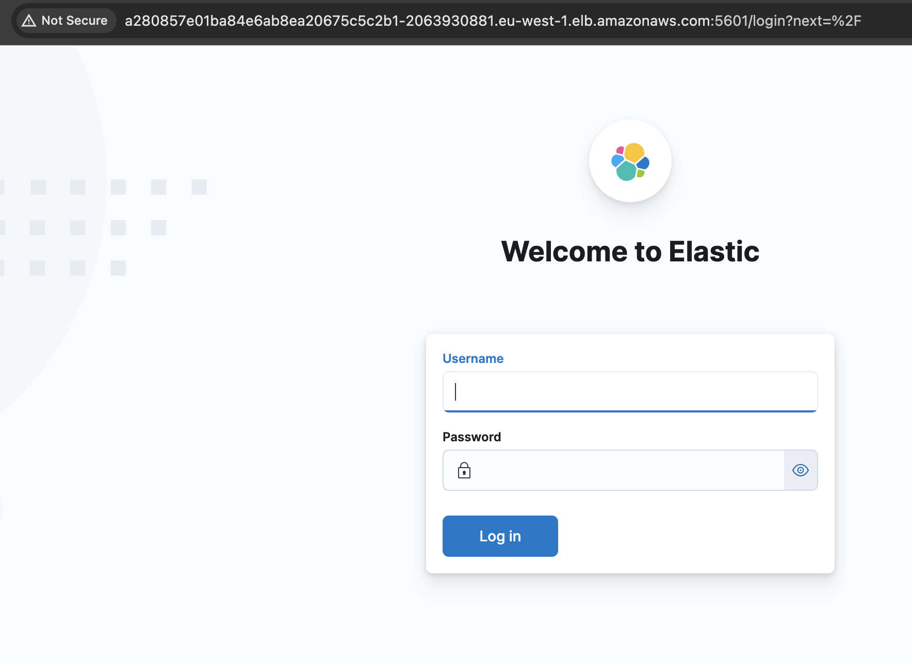

# ES Cluster Installation for the Run Team

_This document is intended for the Run Team to lift and run their Elastic Search Cluster on the provided environment. It also provides the installation for Kibana, so that the team can start getting value from the logs collected in ES_

## Index

- [Toolset](#toolset)
- [Pre-Requisites](#pre-requisites)
- [Installation of the Elastic Search in K8s cluster](#installation-of-the-elastic-search-in-k8s-cluster)
- [Users](#users)
- [ElasticSearch and Kibana Use cases and Endpoints](#elasticsearch-and-kibana-use-cases-and-endpoints)
- [Decisions](#decisions)
- [References](#references)

## Toolset

For this ES installation, the tools required to install the cluster are:

- kubectl CLI
  - [Documentation](https://kubernetes.io/docs/reference/kubectl/)
  - [Installation](https://kubernetes.io/docs/tasks/tools/)

Select the appropriate platform when downloading the binaries and make sure the tool above is compatible with the 1.23 version of Kubernetes.

## Pre Requisites

The following criteria should be met before the installation:

- The Provided Kubernetes Cluster is accessible from the client that will execute the commands.
- The kubeconfig file to connect to the cluster.
  - You can either set the `KUBECONFIG` environment variable or point each command with `--kubeconfig <path/to/kubeconfig>` flag in each run.
- Make sure the user performing the tasks bellow, does have permissions to create the CRD's and the Operator resources in the environment.

You can test the connection running a command like: `kubectl get nodes` and it should yield the information about your cluster nodes.

```
kubectl get nodes
NAME                                       STATUS   ROLES    AGE     VERSION
ip-10-0-1-209.eu-west-1.compute.internal   Ready    <none>   5d10h   v1.23.17-eks-ae9a62a
ip-10-0-2-34.eu-west-1.compute.internal    Ready    <none>   5d10h   v1.23.17-eks-ae9a62a
ip-10-0-3-51.eu-west-1.compute.internal    Ready    <none>   5d10h   v1.23.17-eks-ae9a62a
```

## Installation of the Elastic Search in K8s cluster

### ES Cluster Installation

For this solution, We opt for the Operator pattern offered by Elastic to install Elastic Search clusters in Kubernetes. It is also the recommended way by Elastic to lift and run the platform, known as `ECK` (Elastic Cloud on Kubernetes).

### ECK Version

The selected version of ECK for this process is `2.7` since it is the latest version that is compatible with the version of Kubernetes installed in the cluster `v1.23.17-eks-ae9a62a`.

### ECK Configuration

For this cluster we will go fo a 3-node Elastic search cluster to ensure availability distributed across the 3 nodes of the provided cluster.

### Installation Steps

Please follow the steps bellow to ensure proper configuration of Elasticsearch in your Kubernetes Cluster

#### Install the Operator

The examples bellow include console output. This helps in verifying that the resources are created successfully. 

**Steps:**


1. Install the Custom Resource Definitions (CRD)

```
$ kubectl create -f https://download.elastic.co/downloads/eck/2.7.0/crds.yaml
```

Output:

```
customresourcedefinition.apiextensions.k8s.io/agents.agent.k8s.elastic.co created
customresourcedefinition.apiextensions.k8s.io/apmservers.apm.k8s.elastic.co created
customresourcedefinition.apiextensions.k8s.io/beats.beat.k8s.elastic.co created
customresourcedefinition.apiextensions.k8s.io/elasticmapsservers.maps.k8s.elastic.co created
customresourcedefinition.apiextensions.k8s.io/elasticsearchautoscalers.autoscaling.k8s.elastic.co created
customresourcedefinition.apiextensions.k8s.io/elasticsearches.elasticsearch.k8s.elastic.co created
customresourcedefinition.apiextensions.k8s.io/enterprisesearches.enterprisesearch.k8s.elastic.co created
customresourcedefinition.apiextensions.k8s.io/kibanas.kibana.k8s.elastic.co created
customresourcedefinition.apiextensions.k8s.io/stackconfigpolicies.stackconfigpolicy.k8s.elastic.co created
```

2. Install the Operator

```
kubectl apply -f https://download.elastic.co/downloads/eck/2.7.0/operator.yaml
```

Output:

```
namespace/elastic-system created
serviceaccount/elastic-operator created
secret/elastic-webhook-server-cert created
configmap/elastic-operator created
clusterrole.rbac.authorization.k8s.io/elastic-operator created
clusterrole.rbac.authorization.k8s.io/elastic-operator-view created
clusterrole.rbac.authorization.k8s.io/elastic-operator-edit created
clusterrolebinding.rbac.authorization.k8s.io/elastic-operator created
service/elastic-webhook-server created
statefulset.apps/elastic-operator created
validatingwebhookconfiguration.admissionregistration.k8s.io/elastic-webhook.k8s.elastic.co created
```

- After running these steps, You should have a namespace for ES and a Pod running for the operator.

```
$ kubectl get ns
NAME              STATUS   AGE
default           Active   3d
elastic-system    Active   48s
kube-node-lease   Active   3d
kube-public       Active   3d
kube-system       Active   3d

$ kubectl get pods -n elastic-system
NAME                 READY   STATUS    RESTARTS   AGE
elastic-operator-0   1/1     Running   0          4m35s
```

**PRO TIP**: In case you need to debug what's happening with the operator, you can follow the logs from the operator with `kubectl -n elastic-system logs -f statefulset.apps/elastic-operator`.

Since the operator manages the ECK deployments, now we need to install an instance of a cluster.

#### Deploy ElasticSearch

For the ECK deployment configuration (the instance of the cluster), let's look at the `1-es.yaml` file bellow. It can be found in the root of this project too.

```yaml
apiVersion: elasticsearch.k8s.elastic.co/v1
kind: Elasticsearch
metadata:
  name: run-team
  namespace: eks
spec:
  version: 8.14.1
  nodeSets:
  - name: all-roles-node
    # we do not specify roles, so all the nodes have the same set of roles
    count: 3
    # For High Availability we set count to 3 
    config:
      index.store.type: niofs
      # see vm-setting/README.md for the reasoning of this config
    podTemplate:
      spec:
        containers:
        - name: elasticsearch
          resources:
            requests:
              memory: 2Gi
              cpu: 1
            limits:
              memory: 2Gi
        # Best practice is to set both, see the "Decisions" section
        affinity:
          podAntiAffinity:
            preferredDuringSchedulingIgnoredDuringExecution:
            - weight: 100
              podAffinityTerm:
                labelSelector:
                  matchLabels:
                    elasticsearch.k8s.elastic.co/cluster-name: run-team
                topologyKey: kubernetes.io/hostname
                # Anti-affinity to avoid landing in the same node more than once
    volumeClaimTemplates:
    - metadata:
        name: elasticsearch-data
      spec:
        accessModes:
        - ReadWriteOnce
        resources:
          requests:
            storage: 10Gi
        storageClassName: gp2
    # Persistent storage
```

**Steps:**

1. Create the deployment namespace

```
$ kubectl create ns eks
namespace/eks created
```

1. Apply the file `1-es.yaml`

```bash
$ kubectl apply -f 1-es.yaml

# we can check the status of the deployment 

$ kubectl get elasticsearch -n eks
NAME       HEALTH   NODES   VERSION   PHASE   AGE
run-team   green    3       8.14.1    Ready   2m8s
```

Now that the deployment is `Green`, we can install Kibana.

#### Deploy Kibana

To ramp up the value off ES, We have included Kibana in this deployment. But please note that this is an optional step.

For the Kibana configuration, we will use the `2-kibana.yaml` file bellow. It can be found in the root of this project too.

```yaml
apiVersion: kibana.k8s.elastic.co/v1
kind: Kibana
metadata:
  name: run-team
  namespace: eks
spec:
  version: 8.14.1
  count: 1
  # Here we just specified 1 resource, as requirements for Kibana are less
  # than the ES cluster. 
  elasticsearchRef:
    name: run-team
  # Points to the ECK name
  http:
    tls:
      selfSignedCertificate:
        disabled: true
    # Disabled to quickly access the dashboard remotely. Please see the "Decisions" section.
```

**Steps:**

1. To deploy Kibana run:

```bash
$ kubect apply -f 2-kibana.yaml 
kibana.kibana.k8s.elastic.co/run-team-kibana created
```

We can also check the status of the Kibana with the command bellow:

```bash
kubectl get kibanas -n eks
NAME       HEALTH   NODES   VERSION   AGE
run-team   green    1       8.14.1    43s
```
#### Set PV to Retain

Current implementation would delete the persisted storage (PVC) if the `elasticsearch` instance is deleted. This step is recommended if you wish to safeguard accidental deletions of the operator instances. Specially if nothing is backing up the EBS volume.

1. Gather all your PV's

```
$ kubectl get pv

NAME                                       CAPACITY   ACCESS MODES   RECLAIM POLICY   STATUS   CLAIM                                                 STORAGECLASS   REASON   AGE
pvc-0c3b3a38-8314-4d74-94c7-9720f3adf931   10Gi       RWO            Delete           Bound    eks/elasticsearch-data-run-team-es-all-roles-node-0   gp2                     3h1m
pvc-2975cd2c-89b2-4f49-ac05-a2bf4b63bfb9   10Gi       RWO            Delete           Bound    eks/elasticsearch-data-run-team-es-all-roles-node-2   gp2                     3h1m
pvc-a4cfd067-44f7-49e1-87e9-1b9ff908f418   10Gi       RWO            Delete           Bound    eks/elasticsearch-data-run-team-es-all-roles-node-1   gp2                     3h1m


```

2. For each PV, run:

```
kubectl patch pv <your-pv-name> -p "{\"spec\":{\"persistentVolumeReclaimPolicy\":\"Retain\"}}"
```

Example:
```
kubectl patch pv pvc-0c3b3a38-8314-4d74-94c7-9720f3adf931 -p "{\"spec\":{\"persistentVolumeReclaimPolicy\":\"Retain\"}}"
kubectl patch pv pvc-2975cd2c-89b2-4f49-ac05-a2bf4b63bfb9 -p "{\"spec\":{\"persistentVolumeReclaimPolicy\":\"Retain\"}}"
kubectl patch pv pvc-a4cfd067-44f7-49e1-87e9-1b9ff908f418 -p "{\"spec\":{\"persistentVolumeReclaimPolicy\":\"Retain\"}}"
```

3. Check the configuration was changed, note the reclaim policy is different:

```
kubectl get pv
NAME                                       CAPACITY   ACCESS MODES   RECLAIM POLICY   STATUS   CLAIM                                                 STORAGECLASS   REASON   AGE
pvc-0c3b3a38-8314-4d74-94c7-9720f3adf931   10Gi       RWO            Retain           Bound    eks/elasticsearch-data-run-team-es-all-roles-node-0   gp2                     3h5m
pvc-2975cd2c-89b2-4f49-ac05-a2bf4b63bfb9   10Gi       RWO            Retain           Bound    eks/elasticsearch-data-run-team-es-all-roles-node-2   gp2                     3h5m
pvc-a4cfd067-44f7-49e1-87e9-1b9ff908f418   10Gi       RWO            Retain           Bound    eks/elasticsearch-data-run-team-es-all-roles-node-1   gp2                     3h5m
```

#### Create LoadBalance Services for EKS

Sometimes, you might need to access the services from outside the cluster. Hence, we can create this services of type   `LoadBalancer` to allow users and applications to connect to the services we made with the Operator.

**Note:** If you don not need to access ES from outside the cluster, skip the file `3-svc-elasticsearch.yaml`

1. Run the following commands:

```
kubectl apply  -f 3-svc-elasticsearch.yaml
kubectl apply  -f 4-svc-kibana.yaml
```

2. Lets get the access URL for Kibana dashboard:

```
$ echo "http://$(kubectl get svc kibana-service-loadbalancer-ext -n eks -o=jsonpath='{.status.loadBalancer.ingress[0].hostname}'):5601"

http://a280857e01ba84e6ab8ea20675c5c2b1-2063930881.eu-west-1.elb.amazonaws.com:5601
```

## Users

Now that the services are accessible, let's go to the dashboard and configure the users so we can use ES and Kibana:

**Steps**:

1. Get the password for the `elastic` user. This is a privilege user. Keep the password safe

```bash
$ kubectl get secret "run-team-es-elastic-user" -n eks -o go-template='{{.data.elastic | base64decode }}' 

s0meRandom1zedStr1ng
```

2. Now head to the obtained URL and use the credentials to log in



3. head to `https://<KIBANA_URL>/app/management/security/users/create` and manage your users. Please avoid using the `elastic` user for anything else than this configuration. Also keep in mind the _least-privilege_ mindset when adding roles to the users.

## ElasticSearch and Kibana Use cases and Endpoints

To use the services deployed, find a common list of use cases bellow:

####  Use Case 1.1: Application Client interacts with to Elastic Search API from within the cluster

**Description**: An application running inside the cluster requires to send logs or interact with the ES cluster.

| Scope | URL |
|---|---|
|Cluster| `http://run-team-es-http.eks.svc.cluster.local:9200`

Connectivity check:
```
tmp-shell:~# curl -k -u user:pass https://run-team-es-http.eks.svc.cluster.local:9200

{
  "name" : "run-team-es-all-roles-node-2",
  "cluster_name" : "run-team",
  "cluster_uuid" : "L3WUOQ40Ss2SIgL9mExApw",
  "version" : {
    "number" : "8.14.1",
    "build_flavor" : "default",
    "build_type" : "docker",
    "build_hash" : "93a57a1a76f556d8aee6a90d1a95b06187501310",
    "build_date" : "2024-06-10T23:35:17.114581191Z",
    "build_snapshot" : false,
    "lucene_version" : "9.10.0",
    "minimum_wire_compatibility_version" : "7.17.0",
    "minimum_index_compatibility_version" : "7.0.0"
  },
  "tagline" : "You Know, for Search"
}
tmp-shell:~#

```

#### Use Case 1.2: Application Client interacts with to Elastic Search API from outside the cluster, within AWS Premise

**Description**: An application running outside the cluster, but within the AWS premise (VCP/Network subnet) requires to interact with the ES cluster API.

_Note: Make sure the appropriate network routing tables exist and the Security groups allow communication._


| Scope | URL |
|---|---|
|AWS Internal| `https://internal-aa25fa92f96974d4dbd5ee2abf2cc142-1160122258.eu-west-1.elb.amazonaws.com:9200`


#### Use Case 2.1: User accesses to Kibana Website from within the AWS Premise

**Description**: A run team member access Kibana while connected to the company Network.

| Scope | URL |
|---|---|
|AWS Internal| `https://internal-ad05e5c42ecd34ad7a944cacf4ec1473-1629744523.eu-west-1.elb.amazonaws.com:5601`


#### Use Case 2.2: User access to Kibana Website Outside the AWS premise
_Note: For security reasons, I have removed this endpoint, please see below why. You can re-apply `4-svc-kibana.yaml` if needed, however the url will be different._

**Description**: A run team member access Kibana remotely from outside the Company Network. 

| Scope | URL |
|---|---|
|Public| `a280857e01ba84e6ab8ea20675c5c2b1-2063930881.eu-west-1.elb.amazonaws.com:5601`

## Uninstall

To remove all the components we installed, you can run:

_**NOTE:** Removing the services (\*svc\*.yaml) will result in loosing the current External IP attached to it, any integration will fail as it is randomized for now, these 2 files can be skipped if you wish to retain the ExternalIP value_
```bash
kubectl delete -f 4-svc-elasticsearch.yaml 
kubectl delete -f 3-svc-kibana.yaml
kubectl delete -f 2-kibana.yaml
kubectl delete -f 1-es.yaml
# Finally delete the Namespace
kubectl delete ns eks

```

## Decisions

### Resources for the ES and Kibana

While adhering to best practices, we set resources base on fictional numbers (ie: to put something), as Elastic recommends to set `requests` and `limits` for Memory and `requests` for CPU.  Please see this [Link](https://www.elastic.co/guide/en/cloud-on-k8s/2.7/k8s-managing-compute-resources.html#k8s-compute-resources-elasticsearch) for more information. Same case for kibana, however, since is less critical for this exercise, it was skipped.

### Certificate and URL Strategy
For this task, I could not figure the best strategy in terms of certificates and URL. I kept internal communications going to ES with SSL. However an extra step of taking out the public cert to add it to the clients is needed to connect to it.

When it comes to Kibana, I chose to use plain http for a quick set up and screenshoting the demo. I imagine it is usefull in a real environment for the run-team within a network (Internally in AWS, through VPN) where we have a more structured domain and certificate procedures. I have deleted the loabalance service now to avoid unwanted and unneeded exposure. The logs bellow show this process:

```bash

$ kubectl get svc -n eks 
NAME                              TYPE           CLUSTER-IP       EXTERNAL-IP                                                                        PORT(S)          AGE
es-service-loadbalancer-int       LoadBalancer   172.20.17.11     internal-aa25fa92f96974d4dbd5ee2abf2cc142-1160122258.eu-west-1.elb.amazonaws.com   9200:30278/TCP   119m
kibana-service-loadbalancer-ext   LoadBalancer   172.20.192.221   a280857e01ba84e6ab8ea20675c5c2b1-2063930881.eu-west-1.elb.amazonaws.com            5601:32406/TCP   126m
kibana-service-loadbalancer-int   LoadBalancer   172.20.37.143    internal-ad05e5c42ecd34ad7a944cacf4ec1473-1629744523.eu-west-1.elb.amazonaws.com   5601:31407/TCP   126m
run-team-es-all-roles-node        ClusterIP      None             <none>                                                                             9200/TCP         142m
run-team-es-http                  ClusterIP      172.20.126.181   <none>                                                                             9200/TCP         142m
run-team-es-internal-http         ClusterIP      172.20.53.163    <none>                                                                             9200/TCP         142m
run-team-es-transport             ClusterIP      None             <none>                                                                             9300/TCP         142m
run-team-kb-http                  ClusterIP      172.20.188.35    <none>                                                                             5601/TCP         127m

$ kubectl -n eks delete svc kibana-service-loadbalancer-ext
service "kibana-service-loadbalancer-ext" deleted
``` 


### 3 Node cluster with Anti-Affinity Rules and Use Provided Storage Class with Retain policy

With a resilient infrastructure in mind, I have set all these values. Please see [Solution](SOLUTION.md#outline-how-the-solution-will-handle-potential-failures-to-maintain-continuous-service-availability) for more in-depth explanation of reasoning.


# References

- [ES Helmchart on Github](https://github.com/elastic/helm-charts/blob/main/README.md)
- [Deploy ECK on Kubernetes (2.7)](https://www.elastic.co/guide/en/cloud-on-k8s/2.7/k8s-deploy-eck.html)
- [ECK Node Sets](https://www.elastic.co/guide/en/cloud-on-k8s/current/k8s-orchestration.html#k8s-nodesets)
- [Node Roles](https://www.elastic.co/guide/en/elasticsearch/reference/current/modules-node.html)
- [ECK Virtual Memory](https://www.elastic.co/guide/en/cloud-on-k8s/master/k8s-virtual-memory.html#k8s-virtual-memory)
- [Accessing ECK Services](https://www.elastic.co/guide/en/cloud-on-k8s/1.0/k8s-accessing-elastic-services.html#k8s-accessing-elastic-services)
- [Change PV Reclaim Policy](https://kubernetes.io/docs/tasks/administer-cluster/change-pv-reclaim-policy/)